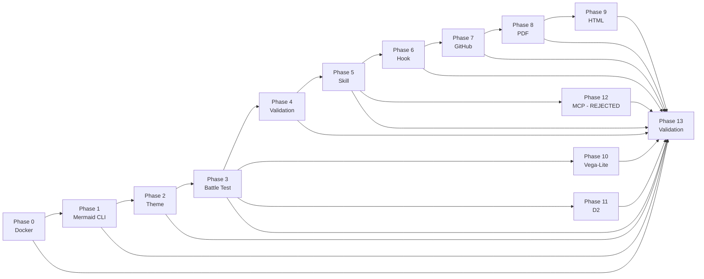

# Mermaid Hybrid Stack Integration Guide

[](LICENSE)
[](#environment-decisions)

Enterprise-grade diagram-as-code pipeline using Mermaid, Vega-Lite, and D2. 14-phase setup guide with automation scripts, config templates, 10 diagram source files, and an interactive tutorial. Cost: $0 -- all tools MIT/BSD/MPL-2.0 licensed.

## Phase Dependency Graph



## Reading Order

Follow the phases in order. Each phase builds on the previous one unless noted otherwise.

| # | Phase | Time |
|---|-------|------|
| 0 | [Docker Desktop WSL 2 Backend Verification](phase-00-docker-setup/README.md) | 10 min |
| 1 | [Mermaid CLI Installation via Docker](phase-01-mermaid-cli/README.md) | 15 min |
| 2 | [Enterprise Theme Configuration](phase-02-enterprise-theme/README.md) | 10 min |
| 3 | [Battle Test -- Threshold Escalation Flowchart](phase-03-battle-test/README.md) | 20 min |
| 4 | [Syntax Validation with @probelabs/maid](phase-04-syntax-validation/README.md) | 5 min |
| 5 | [Claude Code Skill -- Mermaid Diagram Generator](phase-05-claude-skill/README.md) | 15 min |
| 6 | [PostToolUse Hook -- Auto-Render on Write](phase-06-auto-render-hook/README.md) | 10 min |
| 7 | [GitHub Native Rendering Setup](phase-07-github-rendering/README.md) | 10 min |
| 8 | [PDF Integration Pipeline](phase-08-pdf-pipeline/README.md) | 20 min |
| 9 | [HTML Portfolio Embedding](phase-09-html-embedding/README.md) | 10 min |
| 10 | [Vega-Lite -- Heatmaps and Data Charts](phase-10-vega-lite/README.md) | 15 min |
| 11 | [D2 -- Complex Architecture Diagrams](phase-11-d2-diagrams/README.md) | 15 min |
| 12 | [MCP Server Evaluation (REJECTED)](phase-12-mcp-evaluation/README.md) | 5 min |
| 13 | [Full Validation and Cleanup](phase-13-validation-cleanup/README.md) | 30 min |

**Total: ~3 hours**

## Quick Start

```bash
git clone https://github.com/<your-username>/mermaid-hybrid-stack-guide.git
cd mermaid-hybrid-stack-guide

# Verify Docker is running
docker info > /dev/null 2>&1 && echo "Docker OK" || echo "Start Docker Desktop first"

# Begin Phase 0
cd phase-00-docker-setup
cat README.md
```

## File Structure

```
mermaid-hybrid-stack-guide/
├── .gitignore
├── LICENSE
├── README.md
├── PROGRESS.md
├── TOOL-COMPARISON.md
├── TROUBLESHOOTING.md
├── REFERENCE.md
├── GLOSSARY.md
├── scripts/
│   ├── platform-detect.sh
│   ├── validate-repo.sh
│   └── render-all.sh
├── diagrams/
│   ├── system-architecture.d2
│   ├── threshold-escalation.mmd
│   ├── token-economics.vl.json
│   ├── before-after-workflow.mmd
│   ├── config-hierarchy.mmd
│   ├── phase-dependencies.mmd
│   ├── decision-matrix.vl.json
│   ├── gantt-timeline.mmd
│   ├── error-resolution.mmd
│   └── inventory-table.md
├── tutorial/
│   ├── README.md
│   ├── 01-hello-diagrams.md
│   ├── 02-theme-your-kennel.md
│   ├── 03-validate-the-litter.md
│   ├── 04-teach-claude-to-draw.md
│   ├── 05-publish-to-github.md
│   ├── 06-data-charts-and-blueprints.md
│   ├── 07-full-pipeline-test.md
│   └── assets/sample-project/
│       ├── README.md
│       ├── pets.mmd
│       ├── pets-dark.mmd
│       ├── adoption-stats.vl.json
│       └── shelter-architecture.d2
├── phase-00-docker-setup/
│   ├── README.md
│   ├── verify-docker.sh
│   └── configs/
│       └── docker-resources.example
├── phase-01-mermaid-cli/
│   ├── README.md
│   ├── install-mermaid.sh
│   ├── setup-path.sh
│   ├── test-render.sh
│   └── configs/
│       └── test-flowchart.mmd.example
├── phase-02-enterprise-theme/
│   ├── README.md
│   ├── create-theme.sh
│   ├── create-dark-wrapper.sh
│   ├── test-themes.sh
│   └── configs/
│       ├── config.json.example
│       └── config-dark.json.example
├── phase-03-battle-test/
│   ├── README.md
│   ├── create-test-diagram.sh
│   ├── render-and-compare.sh
│   └── configs/
│       └── threshold-escalation.mmd.example
├── phase-04-syntax-validation/
│   ├── README.md
│   ├── install-maid.sh
│   ├── create-validate-wrapper.sh
│   ├── test-validation.sh
│   └── configs/
│       └── broken-test.mmd.example
├── phase-05-claude-skill/
│   ├── README.md
│   ├── create-skill.sh
│   ├── test-skill.sh
│   └── configs/
│       └── SKILL.md.example
├── phase-06-auto-render-hook/
│   ├── README.md
│   ├── create-hook.sh
│   ├── add-permissions.sh
│   ├── test-hook.sh
│   └── configs/
│       ├── settings-hook.json.example
│       └── permissions.json.example
├── phase-07-github-rendering/
│   ├── README.md
│   ├── setup-github-rendering.sh
│   ├── update-bootstrap.sh
│   └── configs/
│       └── gitignore-global.example
├── phase-08-pdf-pipeline/
│   ├── README.md
│   ├── install-pandoc.sh
│   ├── create-batch-render.sh
│   ├── create-pdf-script.sh
│   ├── test-pdf-pipeline.sh
│   └── configs/
│       └── pandoc-defaults.example
├── phase-09-html-embedding/
│   ├── README.md
│   ├── embed-diagrams.sh
│   ├── test-embed.sh
│   └── configs/
│       └── astro-embed.example
├── phase-10-vega-lite/
│   ├── README.md
│   ├── install-vega.sh
│   ├── create-vega-wrapper.sh
│   ├── test-vega.sh
│   └── configs/
│       └── vega-spec.example
├── phase-11-d2-diagrams/
│   ├── README.md
│   ├── install-d2.sh
│   ├── create-d2-wrapper.sh
│   ├── test-d2.sh
│   └── configs/
│       └── d2-sample.d2.example
├── phase-12-mcp-evaluation/
│   └── README.md
├── phase-13-validation-cleanup/
│   ├── README.md
│   ├── create-batch-script.sh
│   ├── run-validation.sh
│   ├── cleanup-instructions.sh
│   └── configs/
│       └── cleanup-checklist.example
```

## Environment Decisions

| Decision | Choice | Rationale |
|----------|--------|-----------|
| Host OS | WSL 2 (Ubuntu 24.04) | Primary dev environment; macOS also supported |
| Container Runtime | Docker Desktop | Mermaid CLI runs via Docker for isolation |
| Node.js | v20+ | Required for maid, Vega-Lite CLI tools |
| Mermaid CLI | Docker image (minlag/mermaid-cli) | Avoids native Puppeteer/Chromium dependency issues |
| Shell | Bash | Cross-platform (WSL 2 + macOS + Linux) |

## Tool Stack

| Tool | Use Case | Input Format | Output | Cost |
|------|----------|--------------|--------|------|
| Mermaid | Flowcharts, sequences, Gantt charts | `.mmd` | SVG, PNG | Free (MIT) |
| Vega-Lite | Heatmaps, grouped bar charts, data vis | `.vl.json` | SVG, PNG | Free (BSD-3) |
| D2 | Multi-layer architecture diagrams | `.d2` | SVG, PNG | Free (MPL-2.0) |

## Step Delegation Guide

What you do manually vs what the AI assistant handles for you.

| Step | User | AI Assistant |
|------|------|--------------|
| Docker Desktop install | Manual (GUI) | Verify via script |
| Mermaid CLI setup | Run script | Generate wrapper scripts |
| Theme configuration | Review colors | Generate config files |
| Diagram creation | Describe intent | Generate .mmd/.vl.json/.d2 source |
| Syntax validation | Review errors | Auto-validate via hook |
| Rendering | Trigger via save | Auto-render via PostToolUse hook |
| GitHub setup | Push to repo | Configure .gitignore, rendering |
| PDF generation | Review output | Batch render + Pandoc pipeline |

## AI Assistant Recommendation

This guide is optimized for Claude Code with the Claude Max subscription plan. The Phase 5 skill and Phase 6 hook automate diagram generation and rendering. Other AI assistants can follow the manual steps in each phase.

## Interactive Tutorial

See [tutorial/README.md](tutorial/README.md) for a hands-on walkthrough: 7 exercises, ~2 to 3 hours, dogs-and-cats theme. Designed for beginners who want to build a sample project before tackling the full pipeline.

## Diagrams

All 10 diagram source files live in the `diagrams/` directory.

| # | Diagram | Tool | Source File |
|---|---------|------|-------------|
| 1 | System Architecture | D2 | [`diagrams/system-architecture.d2`](diagrams/system-architecture.d2) |
| 2 | Threshold Escalation | Mermaid | [`diagrams/threshold-escalation.mmd`](diagrams/threshold-escalation.mmd) |
| 3 | Token Economics | Vega-Lite | [`diagrams/token-economics.vl.json`](diagrams/token-economics.vl.json) |
| 4 | Before/After Workflow | Mermaid | [`diagrams/before-after-workflow.mmd`](diagrams/before-after-workflow.mmd) |
| 5 | Config File Hierarchy | Mermaid | [`diagrams/config-hierarchy.mmd`](diagrams/config-hierarchy.mmd) |
| 6 | Phase Dependency Graph | Mermaid | [`diagrams/phase-dependencies.mmd`](diagrams/phase-dependencies.mmd) |
| 7 | Decision Matrix Heatmap | Vega-Lite | [`diagrams/decision-matrix.vl.json`](diagrams/decision-matrix.vl.json) |
| 8 | Gantt Timeline | Mermaid | [`diagrams/gantt-timeline.mmd`](diagrams/gantt-timeline.mmd) |
| 9 | Error Resolution | Mermaid | [`diagrams/error-resolution.mmd`](diagrams/error-resolution.mmd) |
| 10 | Component Inventory | Markdown | [`diagrams/inventory-table.md`](diagrams/inventory-table.md) |

## Troubleshooting

See [TROUBLESHOOTING.md](TROUBLESHOOTING.md) -- 11 documented errors with symptoms, root causes, and fixes.

## Tool Comparison

See [TOOL-COMPARISON.md](TOOL-COMPARISON.md) -- when to use Mermaid vs Vega-Lite vs D2.

## Glossary

See [GLOSSARY.md](GLOSSARY.md) -- 27 technical terms defined for beginners.

## References

See [REFERENCE.md](REFERENCE.md) -- installed tools, custom scripts, file naming conventions.

## License

MIT -- see [LICENSE](LICENSE) for details.
