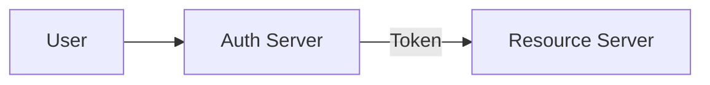

# Phase 7: GitHub Native Rendering Setup

**Time estimate: 10 minutes**

## Why

GitHub renders Mermaid diagrams natively in markdown files, pull request
descriptions, issues, and wikis. Storing diagrams as plain `.mmd` text in your
repository gives you three things that binary image files do not:

1. **Version control** -- every diagram change is a readable text diff.
2. **PR review** -- teammates see exactly what changed in a diagram without
   downloading and diffing image files.
3. **Zero build step** -- GitHub renders on read; you don't need a CI job to
   convert `.mmd` to `.svg` for documentation.

## How to Embed Mermaid in Markdown

Wrap any Mermaid diagram in a fenced code block with the `mermaid` language tag:

````markdown

````

GitHub renders this inline wherever the markdown is displayed.

## GitHub Limitations

These features work in mermaid-cli but NOT in GitHub's renderer:

| Feature | GitHub | mermaid-cli |
|---|---|---|
| ELK layout engine | No | Yes |
| Font Awesome icons | No | Yes |
| Clickable hyperlinks | No | Yes |
| Custom theme variables | No | Yes |
| Diagrams over ~50 KB | No | Yes |

Design around these limits for diagrams destined for GitHub markdown. Use
mermaid-cli output (SVG/PNG) for documentation that needs those features.

## Steps

### 1. Set up gitignore for diagram artifacts

```bash
bash phase-07-github-rendering/setup-github-rendering.sh
```

This creates a global gitignore that excludes rendered artifacts (SVG, PNG,
PDF) from the `diagrams/` directory. Source `.mmd` files are still tracked.

### 2. Update your new-project bootstrap (optional)

```bash
bash phase-07-github-rendering/update-bootstrap.sh
```

Adds `diagrams/` and `docs/` to the template that `~/bin/new-project` creates.

### 3. Add embedded diagrams to your README

Use the fenced code block syntax above. Commit the `.mmd` source files to
`diagrams/` for local rendering; reference them in markdown for GitHub rendering.

## Gate / PASS Criteria

- [ ] `~/.gitignore_global` exists and contains `diagrams/*.svg`
- [ ] `git config --global core.excludesFile` points to `~/.gitignore_global`
- [ ] A markdown file with a `mermaid` fenced block renders correctly on GitHub
- [ ] `git status` in a project does not show `.svg` / `.png` files in `diagrams/`
      as untracked

---

> Tested with Docker 24+, Node v20+, mermaid-cli 11+. Tool versions may change -- adapt as needed.
