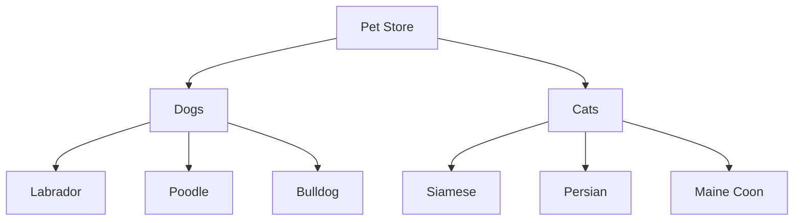

# Exercise 05 -- Publish to GitHub: Version-Controlled Diagrams

**Phase mapping:** Phase 7
**Time estimate:** 20-30 minutes

---

## Goal

Initialize a git repository in your pets project, configure it to ignore rendered outputs,
write a README with an embedded Mermaid diagram, and push to GitHub. Verify that GitHub
renders the Mermaid block natively in the README.

---

## Step 1: Initialize a git repository

```bash
cd ~/projects/pets-diagrams
git init
git branch -m main
```

---

## Step 2: Configure the global gitignore for diagram outputs

The Phase 7 setup should have already configured `~/.gitignore_global`. Verify it
contains rules for rendered diagram outputs:

```bash
cat ~/.gitignore_global | grep -E "svg|png|d2|vl"
```

Expected entries:

```
# Diagram rendered outputs (generated artifacts -- do not commit)
diagrams/*.svg
diagrams/*.png
*.svg
*.png
```

If missing, add them:

```bash
cat >> ~/.gitignore_global << 'EOF'

# Diagram rendered outputs (generated artifacts -- do not commit)
*.svg
*.png
EOF
git config --global core.excludesfile ~/.gitignore_global
```

This ensures rendered SVG and PNG files are never accidentally staged.

---

## Step 3: Create a README with embedded Mermaid

Create `README.md` in the pets project:

````markdown
# Pets Diagram Project

A sample project demonstrating the Mermaid Hybrid Stack tutorial.

## Pet Store Hierarchy



## Source Files

- `pets.mmd` -- Pet store hierarchy flowchart
- `cat-adoption.mmd` -- Cat adoption process flowchart (AI-generated)
- `adoption-stats.vl.json` -- Monthly adoption statistics (Vega-Lite)
- `shelter-architecture.d2` -- Shelter system architecture (D2)
````

---

## Step 4: Stage only the source files

Add the source files explicitly. Do not add SVG or PNG files:

```bash
git add pets.mmd cat-adoption.mmd README.md
git status
```

Expected output shows only `.mmd` and `.md` files staged. SVG files should appear
under "Untracked files" but not "Changes to be committed" -- the gitignore rule
prevents them from being staged.

---

## Step 5: Commit and push to GitHub

```bash
git commit -m "feat: add pets diagram project with flowchart sources"
```

Create a new repository on GitHub (replace `<your-username>` with your GitHub username):

```bash
gh repo create pets-diagrams --public --source=. --remote=origin --push
```

Or if you prefer the manual approach:

```bash
# Create the repo on GitHub first, then:
git remote add origin https://github.com/<your-username>/pets-diagrams.git
git push -u origin main
```

---

## Step 6: Verify the Mermaid diagram renders on GitHub

Open your new repository in a browser:

```
https://github.com/<your-username>/pets-diagrams
```

GitHub natively renders Mermaid code blocks (triple-backtick `mermaid`) in README files.
You should see the pet store flowchart rendered as an interactive diagram directly in the
README -- no plugin or extension required.

---

## Why this matters

**Source files are version-controlled; rendered outputs are generated artifacts.**

| File type | Commit? | Why |
|-----------|---------|-----|
| `.mmd` source | Yes | Human-readable, diffable, the single source of truth |
| `.vl.json` source | Yes | Same reasoning -- data + chart spec in one file |
| `.d2` source | Yes | Architecture as code, reviewable in PRs |
| `.svg` output | No | Binary-ish, large diffs, regenerated on demand |
| `.png` output | No | Binary, bloats repo history, regenerated on demand |

When a teammate clones the repo, they run `render-all-diagrams` once to generate all
SVG outputs locally. The source files are the canonical artifact.

---

## What you learned

- Gitignore rules block rendered outputs from being staged accidentally
- GitHub renders Mermaid natively in README files using triple-backtick `mermaid` blocks
- Source `.mmd` files are committed; rendered `.svg` files are not
- The `gh` CLI can create and push a repo in one command

---

## Next exercise

[Exercise 06 -- Data Charts & Blueprints](06-data-charts-and-blueprints.md)
